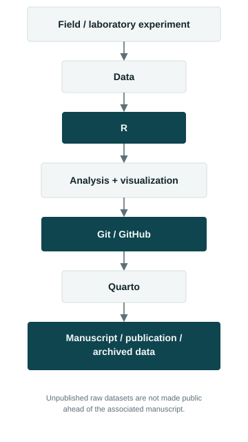

I am committed to reproducible ecological research. Datasets, analysis code,
and supporting materials for completed projects will be archived here as they
become available, typically alongside the associated publication. Raw,
unpublished field and experimental data are not made public ahead of the
associated manuscript.

{fig-alt="Diagram of a reproducible research workflow: field and laboratory experiments produce data, analyzed and visualized in R, version-controlled with Git and GitHub, rendered with Quarto, and resulting in a manuscript, publication, or archived dataset." width="55%"}

## Smallmouth Bass diet and electivity (Chapter 1)

*Data and code will be archived here on publication.*

## Predator–prey trials (Chapter 2)

*Data and code will be archived here on publication.*

## Crayfish thermal preference and competition (Chapter 3)

*Data and code will be archived here on publication.*

## Repositories

[GitHub →](https://github.com/behes2024)
