## Research program

Freshwater invasions rarely happen in isolation. In Oregon rivers, non-native
Smallmouth Bass (*Micropterus dolomieu*) interact with both native Signal
Crayfish (*Pacifastacus leniusculus*) and the expanding non-native Ringed
Crayfish (*Faxonius neglectus*). My dissertation examines these interactions
across three linked studies — from diet patterns and prey availability in the
field, to predator–prey mechanisms in the laboratory, to how temperature
shapes competition between the two crayfish species.

The question running through all three chapters: can interactions among
non-native species alter the course of a biological invasion, and what does
that mean for the native species caught between them?

{fig-alt="Diagram showing Oregon river systems leading to Smallmouth Bass, which interacts with Signal Crayfish and Ringed Crayfish, feeding into three chapters (field diet, predator-prey trials, thermal preference and competition) that converge on understanding species interactions under environmental variation."}

## Study species

::: {.species-grid}
::: {.species-card}
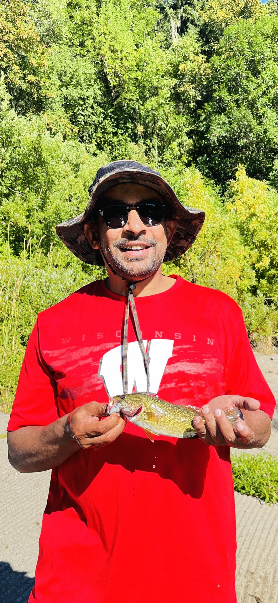{fig-alt="A Smallmouth Bass held in hand during field sampling on an Oregon river."}

**Smallmouth Bass**\
*Micropterus dolomieu*

Non-native predator established in the Willamette and Umpqua Rivers, and the
focal fish species in the diet and predator–prey research (Chapters 1–2).
:::

::: {.species-card}
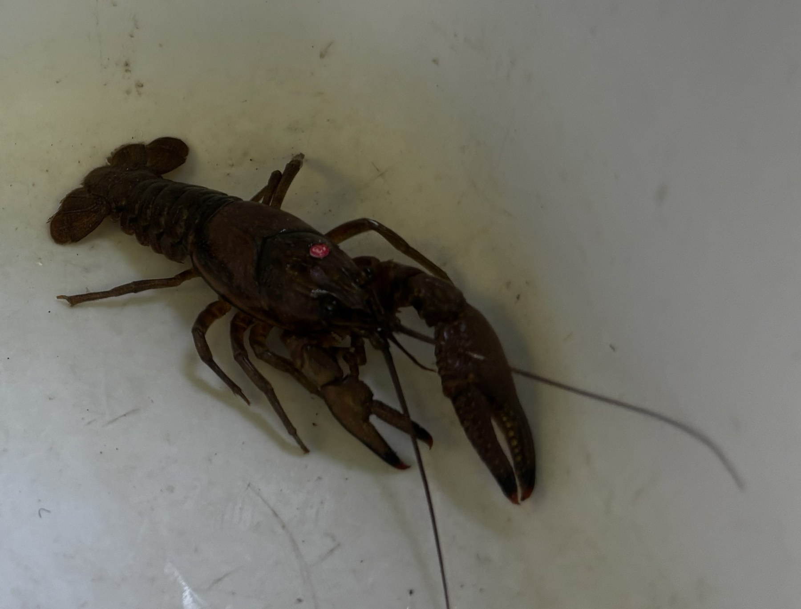{fig-alt="Signal Crayfish (Pacifastacus leniusculus) photographed during capture-mark-recapture field sampling in the Umpqua River system, with an external individual marker visible on the carapace."}

**Signal Crayfish**\
*Pacifastacus leniusculus*

Native crayfish of the Pacific Northwest, and the native prey and competitor
species examined throughout the dissertation.
:::

::: {.species-card}
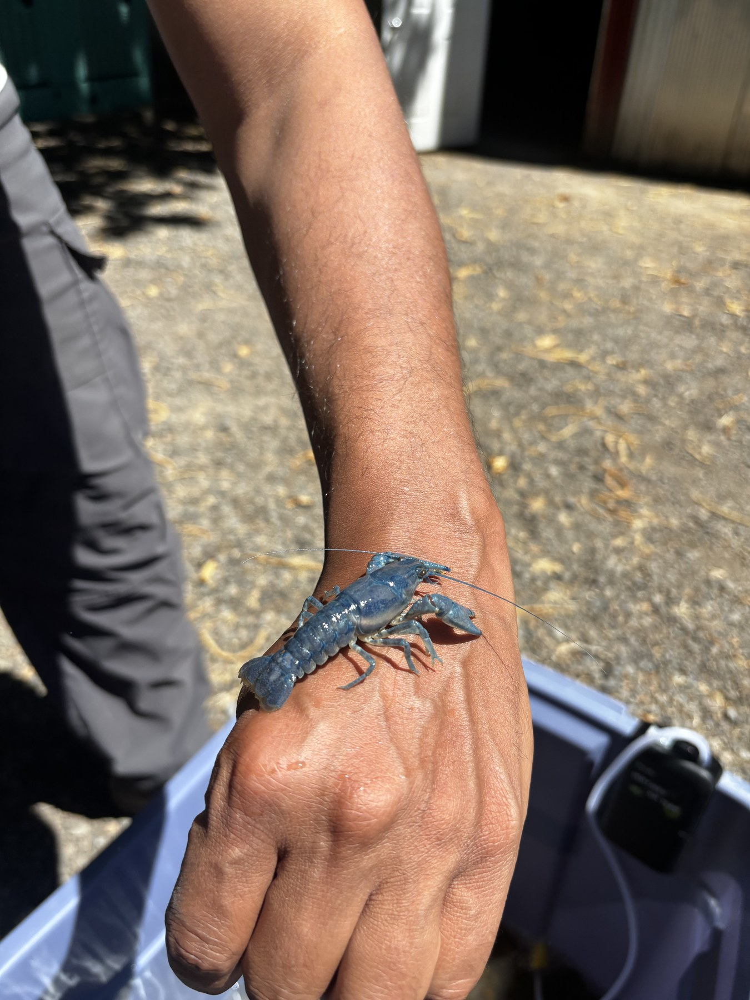{fig-alt="Ringed Crayfish (Faxonius neglectus) showing unusual blue coloration, photographed in the Willamette River system near Eugene, Oregon."}

**Ringed Crayfish**\
*Faxonius neglectus*

Non-native crayfish expanding into Oregon's Umpqua and Rogue basins, and the
focal invader in the predator–prey and competition experiments (Chapters 2–3).
This individual shows unusual blue coloration, occasionally observed in this
species.
:::
:::

## Dissertation chapters

::: {.chapter}
[Chapter 1]{.status}

### Trophic ecology of Smallmouth Bass in two Oregon rivers

**Research questions.**

- How important are crayfish, relative to fish and invertebrates, in
  Smallmouth Bass diets in the Willamette and Umpqua Rivers, and does that
  pattern change across years?
- In the Umpqua River, where Signal and Ringed Crayfish co-occur, does
  Smallmouth Bass show species-specific electivity when diet is compared with
  local crayfish availability?
- How variable is diet composition among years within each river?

**Approach.** Diet samples come from the Willamette River Fish Decadal
Assessment and the annual Umpqua Bass Bash, paired with a standardized
capture–mark–recapture crayfish availability study across five Umpqua sites,
sampled over four days each. Comparing stomach contents with local prey
availability will allow me to calculate Jacobs' electivity index (D) and test
whether Smallmouth Bass select for Ringed over Signal Crayfish rather than
simply consuming whichever is more available. Stomach samples have been
collected across the 2023–2026 field seasons; species-level processing of
those samples is ongoing.

**Study area.** The Willamette and Umpqua River basins, Oregon — two systems
that differ in geomorphology, thermal regime, and crayfish assemblage,
providing a natural contrast for these comparisons.

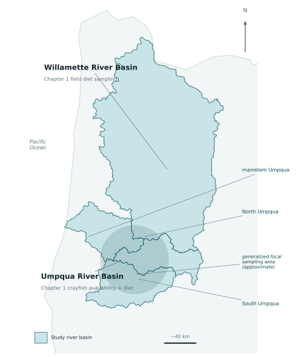{fig-alt="Map of western Oregon showing the Willamette River basin and the Umpqua River basin, including North Umpqua, South Umpqua, and mainstem Umpqua subbasins, with a generalized focal sampling area and no specific coordinates shown."}

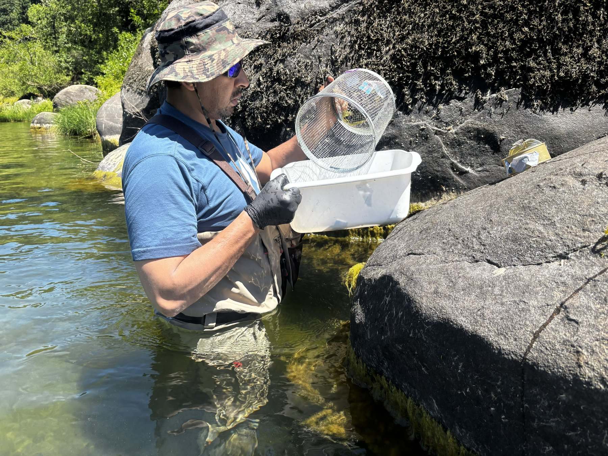{fig-alt="A researcher wearing waders stands in a river, examining a mesh trap over a sorting tray beside a large boulder."}

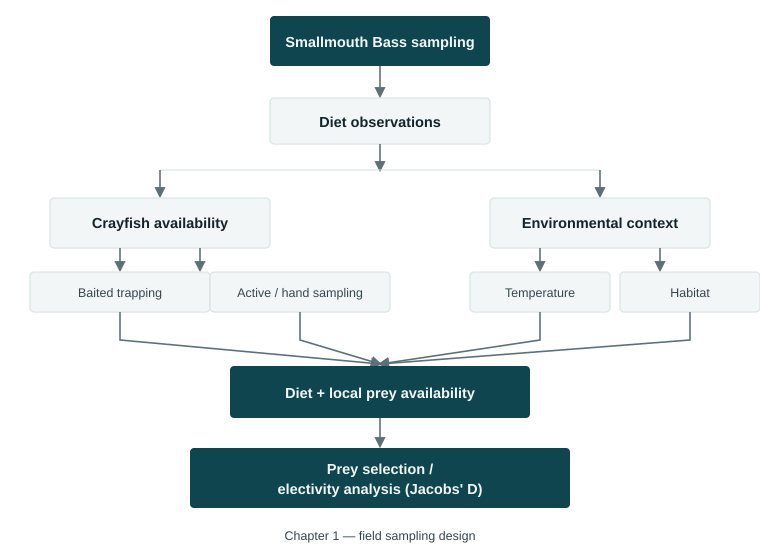{fig-alt="Flowchart showing Smallmouth Bass sampling leading to diet observations, combined with crayfish availability from baited trapping and active hand sampling, and environmental context from temperature and habitat, converging on prey selection and electivity analysis."}
:::

::: {.chapter}
[Chapter 2]{.status}

### Laboratory predator–prey trials: Smallmouth Bass and crayfish

[**When a Smallmouth Bass is offered one Signal Crayfish and one Ringed
Crayfish at matched size, which prey (if either) is consumed first, and how
consistent is that outcome across individuals?**]{.question}

**Experimental design (current protocol).** Each Smallmouth Bass is held in
its own opaque tank and pre-conditioned there overnight (about 12 hours)
before a trial. One Signal Crayfish and one Ringed Crayfish, size-matched by
carapace length, are then introduced together, and the encounter is
video-recorded for a standardized observation period under low, standardized
lighting with disturbance minimized (visual barriers, remote camera control).
Up to six fish are run in parallel across six independent tanks each morning.
Individual bass are tracked across repeated standardized trials with
appropriate recovery intervals between trials.

**Measurements.** The primary outcome is which prey item, if either, is
consumed first. Secondary behavioral metrics include approach, attack,
aborted attacks, capture, latency, escape responses, defensive posture, and
handling time, scored from video.

**Temperature.** The standardized protocol targets a stable working
temperature; pilot testing has explored trial temperatures across roughly
16–25 °C while the protocol was being refined, rather than comparing fixed
"warm" and "cool" treatments as a manipulated factor in this chapter.

**Current status.** Pilot-phase trials are underway to finalize the
protocol; the full dataset under the standardized design has not yet been
collected, and no prey-choice outcome should be treated as a result at this
stage.

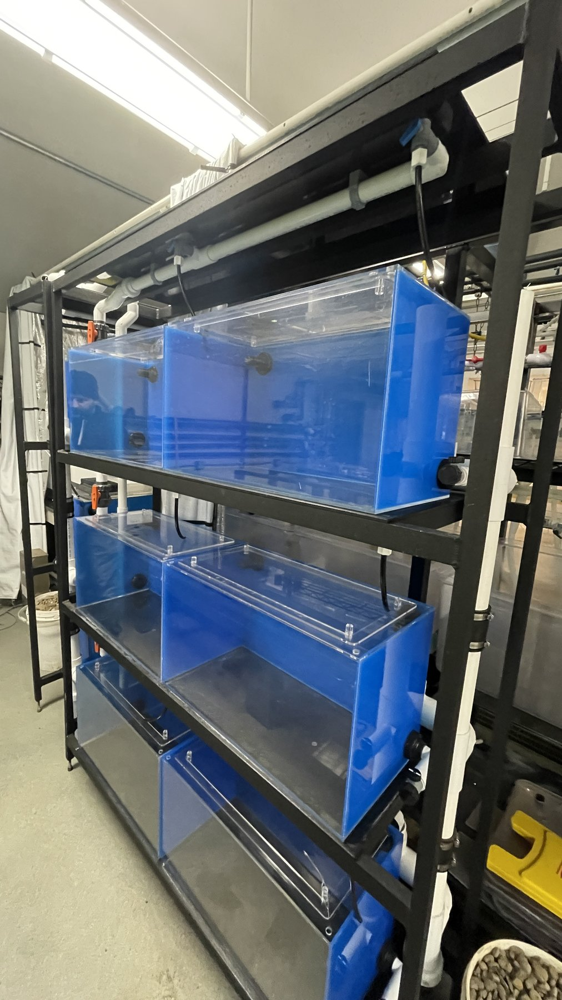{fig-alt="A rack of blue opaque experimental tanks used for predator-prey trials, stacked in rows in a laboratory."}

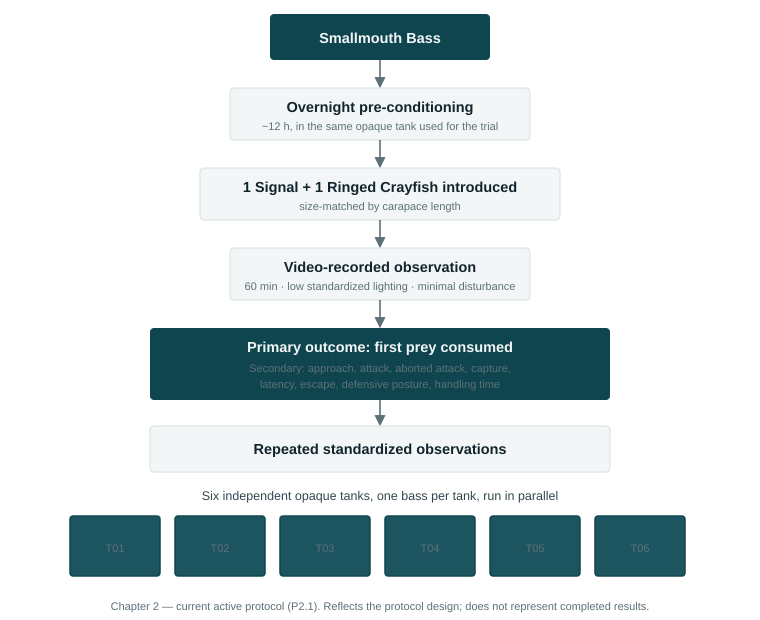{fig-alt="Flowchart showing a Smallmouth Bass pre-conditioned overnight in its tank, then one Signal Crayfish and one Ringed Crayfish introduced together, followed by a video-recorded observation period, an outcome of which prey is consumed first plus secondary behavioral metrics, and repeated standardized trials across six independent opaque tanks."}

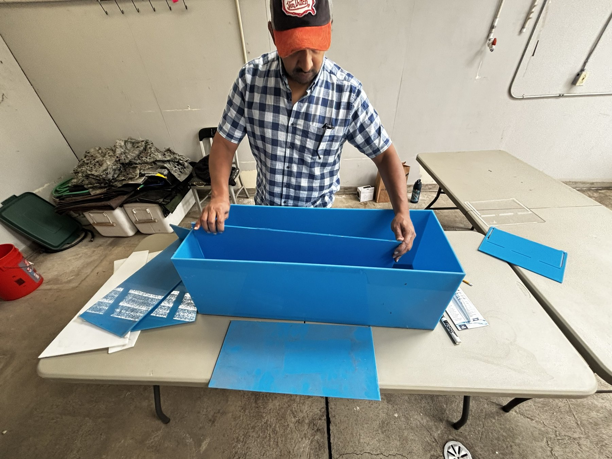{fig-alt="A researcher assembling a custom blue rectangular experimental tank with a center divider on a workbench."}

Once published, this chapter will carry: publication · dataset · R code ·
conference presentation · DOI.
:::

::: {.chapter}
[Chapter 3]{.status}

### Thermal preference and shelter competition between native and non-native crayfish

**Research questions.**

- How does interspecific shelter competition between Signal and Ringed
  Crayfish vary with relative body size and sex?
- How does thermal context change activity levels, encounter rates, and the
  strength of competitive asymmetry between the two species?
- Does displacement from shelter measurably increase a crayfish's behavioral
  exposure?

This chapter has two experimental components at different stages, plus a
planned field component.

**Thermal-choice pilot trials (active).** Individual crayfish are placed in
a two-channel tank with a warm channel, a cool channel, and a shared central
junction. After a 3-minute acclimation period (not analyzed), a 20-minute
recording period is scored for time spent in each zone, latency to first
choice, and number of channel switches, examined across four 5-minute
windows. This is designed as a short-term behavioral-response assay — it
measures immediate zone choice after a controlled warm/cool input, not a
long-term equilibrium preferred temperature. Each individual is tested once
and then moved to a labeled recovery tank. Pilot thermal-choice trials are
underway to refine the behavioral assay and analysis workflow before final
analysis; this is pilot/protocol-testing data, not yet a basis for
conclusions about species differences.

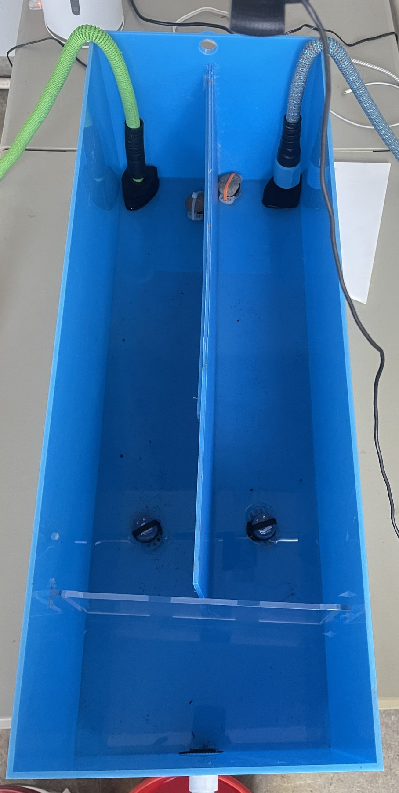{fig-alt="Overhead photo of an empty blue tank divided by a center partition that stops short of one end, with two probes positioned near the far end of each channel."}

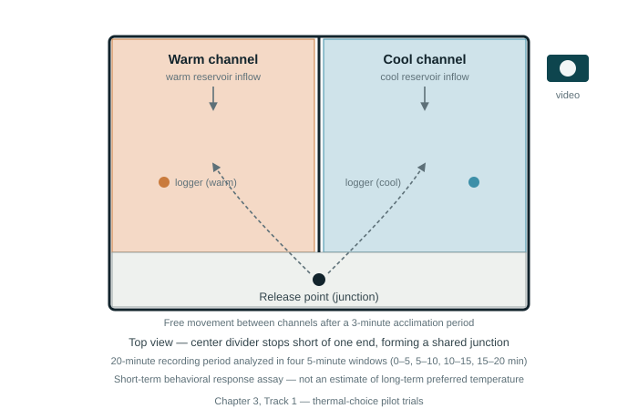{fig-alt="Top-view schematic of a two-channel thermal-choice tank with a warm channel on one side, a cool channel on the other, a shared junction where a crayfish is released, and temperature loggers in each channel."}

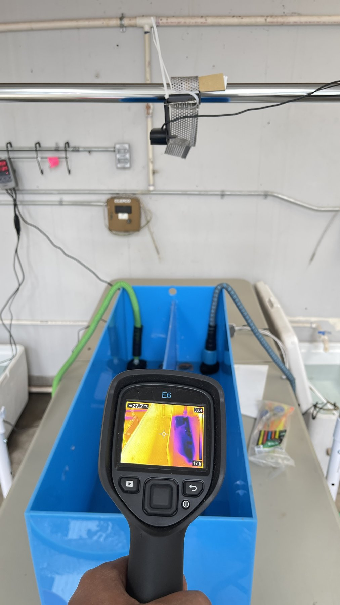{fig-alt="A handheld FLIR thermal-imaging camera held up to a blue divided tank, showing a warm-to-cool color gradient on its screen."}

**Shelter-competition experiment (planned, not yet started).** The approved
design crosses two temperatures (cool 17 °C, warm 23 °C) with two shelter
levels — one refuge, forcing direct competition, versus two refuges — for
size-matched Signal and Ringed Crayfish pairs, with 9 replicates per
combination. Planned 60-minute video-recorded trials would record shelter
dominance, aggression, and displacement, analyzed afterward with tools such
as ToxTrac, Fiji/TrackMate, and DeepLabCut. As of this update, no trials
have been run under this design.

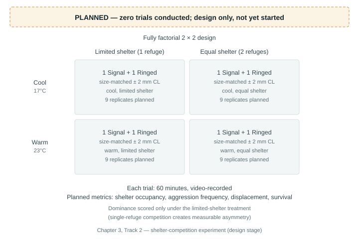{fig-alt="Diagram of a planned 2 by 2 factorial design crossing cool and warm temperatures with limited and equal shelter, for size-matched Signal and Ringed Crayfish pairs, marked as not yet started."}

**Field thermal context (planned, not yet conducted).** The design would
classify Umpqua Basin reaches into cold (≤18 °C), transitional (18–21 °C),
and warm (≥21 °C) categories using a modeled stream-temperature dataset
(Siegel et al. 2023), validated with in-situ loggers, then sample them with
standardized baited traps to characterize crayfish coexistence. This
basin-wide field sampling has not yet been carried out.

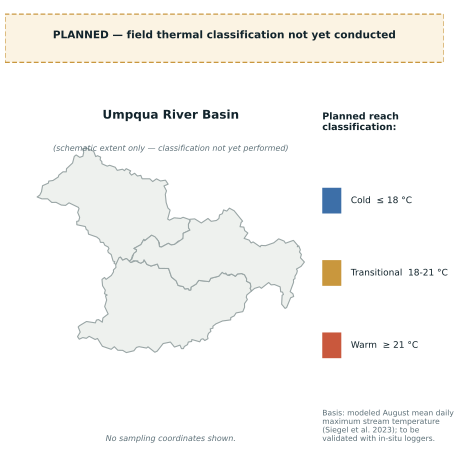{fig-alt="Map of the Umpqua River basin with a legend of planned cold, transitional, and warm reach classifications, marked as not yet sampled, with no specific coordinates shown."}
:::

## Methods and tools

| Area | Methods and tools |
|---|---|
| Field ecology | Smallmouth Bass diet sampling, crayfish trapping and hand sampling, habitat and substrate surveys |
| Environmental monitoring | Modeled stream temperature (Siegel et al. 2023), in-situ temperature loggers (HOBO/Hydromath) |
| Experimental ecology | Predator–prey trials (active pilot testing), thermal-choice trials (active pilot testing), shelter-competition trials (planned) |
| Behavioral ecology | Video recording; BORIS behavioral coding (thermal-choice trials); ToxTrac, Fiji/TrackMate, and DeepLabCut (planned, for the shelter-competition experiment) |
| Quantitative ecology | R, generalized and mixed-effects models, Jacobs' electivity index |
| Reproducible science | Quarto, Git and GitHub, Zotero with Better BibTeX |

## Field and lab gallery

::: {.gallery-grid}
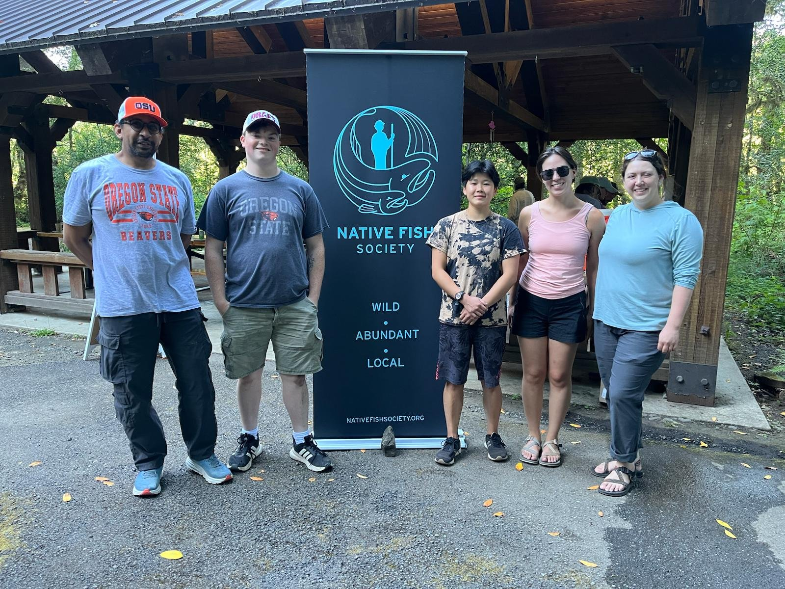{fig-alt="A group of five people standing beside a Native Fish Society banner at an outdoor pavilion."}

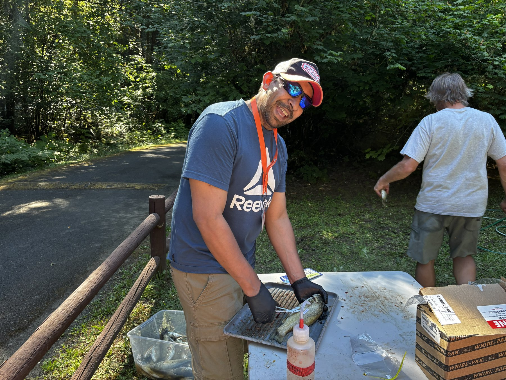{fig-alt="A researcher measuring a fish on a wooden board outdoors, with sample bags visible nearby."}

{fig-alt="A researcher wearing waders in a river, examining a mesh trap over a sorting tray."}

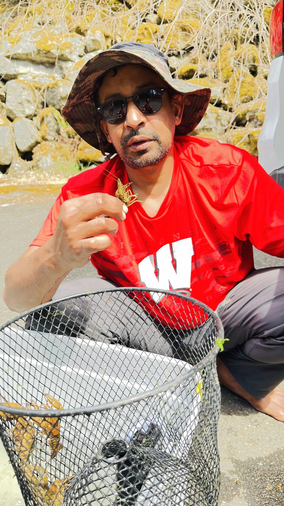{fig-alt="A researcher crouches beside a wire mesh trap holding one crayfish, with several more visible inside the trap."}

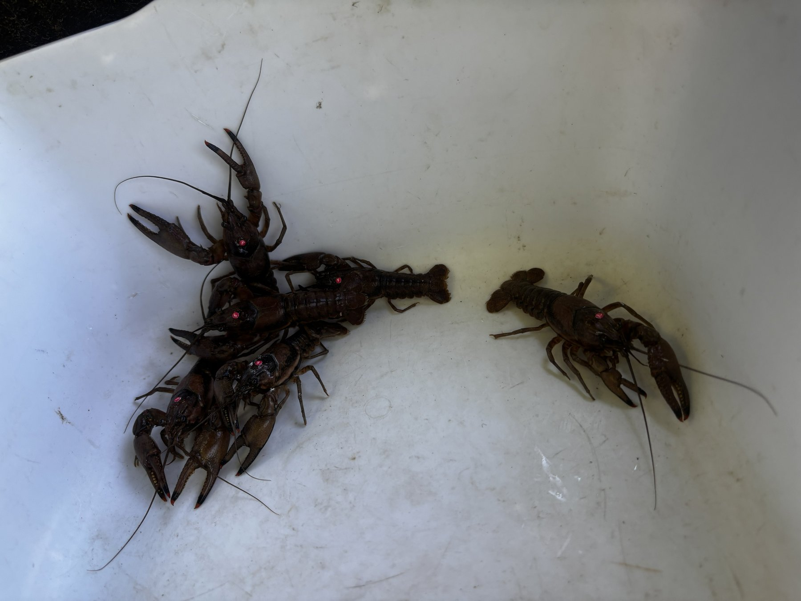{fig-alt="Several crayfish with small marked dots on their carapace, arranged in a white sorting tray."}

{fig-alt="A Smallmouth Bass held in hand during field sampling on an Oregon river."}

{fig-alt="A rack of blue opaque experimental tanks stacked in rows in a laboratory."}

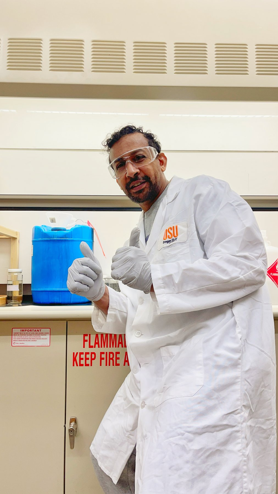{fig-alt="A researcher wearing a lab coat and safety glasses in a laboratory."}
:::
